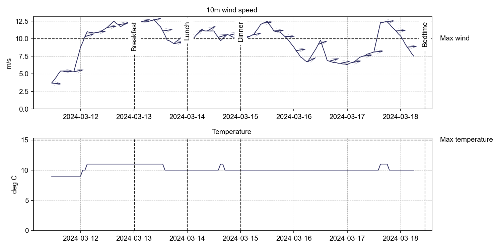

# WaveDave 🏄🏽‍♀️
Practical marine waves and wave response calculations and comparisons.

The name WaveDave is a shameless reference to [DAVE](https://usedave.nl) from the same author.

====================================================================

# This project is under development

API may change without notice

====================================================================


## Introduction

WaveDave is a Python package for practical marine waves and wave response calculations.

It heavily relies on, and combines the functionality of the following packages:
- [wavespectra](https://wavespectra.readthedocs.io/en/latest/) for reading wave-spectra from real-life sources such as model forecasts or buoys
- [waveresponse](https://docs.4insight.io/waveresponse/python/latest/index.html) for calculating spectral properties and responses.
- [fpdf2](https://github.com/py-pdf/fpdf2) for generating PDFs

WaveSpectra is used for importing wave-spectra from real-life sources such as forecasts, models or measurements buoys.
WaveResponse is used for plotting and combining the wave-spectra with RAOs.

This package adds:
- a comprehensible API for creating wave-spectra from external sources (completely wrapping all required wavespectra calls)
- conversion of binned wave-spectra to smooth spectra
- a Spectra object that contains a series of wave-response wave-spectra and corresponding time-stamps.

Example:

```python
from wavedave import Spectra
import matplotlib.pyplot as plt

forecast = Spectra.from_octopus('forecastfile.csv')
plt.plot(forecast.time, forecast.Hs, label = "Forecast")
```

- a few traditional plots as standard report sections (binned source comparison, energy evolution)
- a object-oriented system for creating and reporting custom graphs.
- a pdf report template with header, footer, page numbers and a logo.

# Conventions

times are datetime objects
time is in UTC
frequency is in Hz
Direction is in degrees using coming-from convention
For **wave**-spectra the directions are compass directions

- 0 = coming from North, 
- 90= coming from East, 
- 180= coming from South, 
- 270= coming from West

For **RAOs** the directions are coming from using a mathematical direction: 

- 0 = progressing along x-axis ("from bow") , 
- 90 = progressing along negative y ("from ps)", 
- 180 = progressing against x ("from stern")
- 270 = progressing along y ("from sb")


## Timezone

Internally all data is treated as UTC.

When reading data  from an external source that is not in UTC then first of all try to convince the supplier to deliver the data in UTC. If that doesn't work try harder. If that still doesn't work then switch to a different supplier. If all this fails then supply the conversion to utc to the method that creates the datasource.

The timezone is only applied at the end of the pipeline when the date is converted to something immutable such as a table or a graph. At that time the time-zone is applied by shifting with the amount of hours specified in `report_timezone_UTC_plus` which can be defined at `Settings` level (global) or per   graph.

### Exception

`Events` are defined in the local timezone.

## Date formats

Converting dates can be a real 😠.  Especially when forecasts are delivered in a text format with a different language setting than the computer that WaveDave is run on. WaveDave does not control your computer or your forecast. Sometimes opening the file in excel and saving it again will also change the date format. This can use used to your benefit or frustration, use with care. 

Whenever dates or times need to be converted from text to numbers WaveDave allows you to explicitly specify the date-format to be used. For example:

```python
yesterdays_forecast = IntegratedForecast(filename2, dateformat="%m/%d/%Y %H:%M")
```

tells WaveDave to expect a timestamp like "07/26/2024 12:00"

A timestamp like `11-Mar-2024 13:00` can be formatted using `dateformat = "%d-%b-%Y %H:%M"`

This is done using so called "formatter strings". For a full list see [cheatsheet](https://strftime.org/).


# Project wide settings

Some settings such as the time-zone and colors are likely to be applicable for a whole project. To avoid having to explicitly define them over and over again, the `Settings` module allows setting of the  default values for these settings. Use as follows:

```python
import wavedave.settings as Settings

Settings.LOCAL_TIMEZONE = 1 # report in UTC+1
Settings.COLOR_MAIN = (40,159,168)  # define a different main color (R,G,B)
```


# Sources

"Sources" objects containing data. Available sources are:

| Source                                                       | Object               |
| ------------------------------------------------------------ | -------------------- |
| 2d spectra such as buoy measurement, forecasts or synthetic spectra. | `Spectra`            |
| Integrated forecasts. These are time-series of Hs, Tp, wind, temperature etc. | `IntegratedForecast` |
| RAO. Response Amplitude Operators                            | `RAO`                |
| Measured time-series such as MRU data.                       | `Timeseries`         |
| Calculated response spectra. These are 1D spectra created from either combining RAOs and waves OR performing a spectral analysis on a measure time series. | `ResponseSpectra`    |
| A line in a graph, having a value and optionally a direction defined over time. Typically produced from other sources. | `LineSource`         |


# Spectra

`Spectra` is a thin layer wrapping a series of `DirectionalSpectrum` objects and adding a time vector.

## Creation

Spectra.from_octopus
Spectra.from_obscape

# Properties

Spectra.time : time-series

.Hs : significant wave height
.Tp : peak period

.Tz

.dirs [degrees]

.freq [Hz]


Period bands

.Hs_bands(split_periods)


## Squashed properties

.dir_over_time

.freq_over_time


# Conversion from binned to smooth
WaveDave.to_smooth contains some magic to convert binned wave-spectra to smooth wave-spectra.

# Plotting

plot_spectrum: plots a topview of the 2d spectrum

plot_spectrum_bands

plot_direction_over_time

plot_spectrum_frequencies_over_time


### helpers

sync_ylimits

apply_default_style


# Making reports

WaveDave can be used to generate PDF reports.

PDF reports can be defined flexibly using report elements. This following is an example of a pdf without any real data:

```python
    d = WaveDavePDF()

    # define the report metadata
    d.author = "Ping-pong tafel"
    d.title = "Simple report"
    d.project = "WaveDave example project"
    d.date = "2024-03-11"

    # add some elements using the convenience methods
    d.add_header("Hello")
    d.add_text("This is a very simple report")
    d.add_text("Add more content by defining Graphs and adding them to the report")

    # or, using the add method
    # this enables some additional options such as margins
    # and is also use for adding elements for which no convenience method exists
    # such as graphs or standard report sections
    text_element = Text("<p>This text is added by first defining a Text object"
                        " and then adding it to the report."
                        "<br>Note that some basic HTML tags are supported,"
                        " like <b>bold</b> and <i>italic</i>."
                        "<br>Also, line breaks are supported.<br>Like this."
                        "<br>And this.</p>"
                        "<a href='https://youtu.be/CTDov_uGLss'>This is a link</a><br>"
                        "The `margin` argument is used to increase the margin"
                        , margin=20)
    d.add(text_element)

    # We can also use the HTML to add images from the internet
    d.add(Text("<p>Images from the internet can also be added using HTML:</p>"))
    d.add(Text(""))
        
    # but local is also an option
    d.add(Image("logo.png"))

    d.open()
```

## Making figures

WaveDave contains `Elements` to construct custom standardized figures from custom data-sources. 

The flow is as follows:

- create data-sources by loading forecasts, measurements, etc
- create `LineSource`s from the data-sources
- create `Graphs` from on or more `LineSources`
- create `Figures` from one of more `Graphs`
- plot the figures directly to screen or add them to a report.


Figure has some settings to adjust to overall appearance:

- The x and y axes of the individuals graphs may be synchronized.
- The overall figure size may be specified. 
- Legends can be included below the lowest subplot.


Limits can be added per Graph. Events can be added per Figure:



## Figure

A `Figure` contains one or more `Graphs` (subplots). Optionally it contains `limits` and `events`. 

Legends are by default based on the .label properties of the LineSources. If all labels are the same then these are replaced by the datasource_description property of the LineSources.

## Graph

Every `Graph` contains one or mode `LineSources`.  If units or statistics-types are specified on the line-sources then these shall be identical for all lines sources.

Graph title default to the name of the datasource

## LineSource

A `LineSource` can be created from Spectra, Responses, IntegratedForecasts, Measurements, or manually. A linesource can have plot-options specified and may have a directions which will then be plotted as quivers.


### Getting LineSources

`LineSources` can be obtained from

- Integrated forecasts
  - using the column names
  - the filename is added as datasource_description
- Spectra
  - give_source


