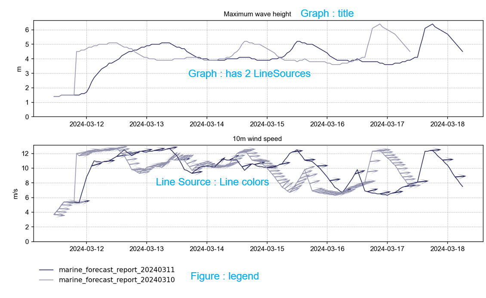

# WaveDave
Practical marine waves and wave response calculations and comparisons.

The name WaveDave is a shameless reference to [DAVE](https://usedave.nl) from the same author.


## Introduction

WaveDave is a Python package for practical marine waves and wave response calculations.

It heavily relies on, and combines the functionality of the following packages:
- [wavespectra](https://wavespectra.readthedocs.io/en/latest/)
- [waveresponse](https://docs.4insight.io/waveresponse/python/latest/index.html)
pdf generation is included using:
- [fpdf2](https://github.com/py-pdf/fpdf2)


WaveSpectra is used for importing wave-spectra from real-life sources such as forecasts, models or measurements buoys.
WaveResponse is used for plotting and combining the wave-spectra with RAOs.

This package adds:
- a comprehensable API for creating wave-spectra from external sources (completely wrapping all required wavespectra calls)
- conversion of binned wave-spectra to smooth spectra
- a Spectra object that contains a series of wave-response wave-spectra and corresponding time-stamps.

Example:

```python
from wavedave import Spectra
import matplotlib.pyplot as plt

forecast = Spectra.from_octopus('forecastfile.csv')
plt.plot(forecast.time, forecast.Hs, label = "Forecast")
```

# Conventions

times are datetime objects
time is in UTC
frequency is in Hz
Direction is in degrees using coming-from convention
For wave-spectra the directions are compass directions (0=N, 90=E, 180=S, 270=W)


## Timezone

Internally all data is treated as UTC

When plotting or reporting, the time is shifted with the amount of hours specified in `report_timezone_UTC_plus`.


# Creation

Spectra.from_octopus
Spectra.from_obscape

# Properties

Spectra.time : time-series

.Hs : significant wave height
.Tp : peak period

.Tz

.dirs [degrees]

.freq [Hz]


Period bands

.Hs_bands(split_periods)


## Squashed properties

.dir_over_time

.freq_over_time


# Conversion from binned to smooth
WaveDave.to_smooth contains some magic to convert binned wave-spectra to smooth wave-spectra.

# Plotting

plot_spectrum: plots a topview of the 2d spectrum

plot_spectrum_bands

plot_direction_over_time

plot_spectrum_frequencies_over_time


### helpers

sync_ylimits

apply_default_style


# Making figures

WaveDave contains `Elements` to construct custom standardized figures from custom data-sources. 

The flow is as follows:

- create data-sources by loading forecasts, measurements, etc
- create `LineSource`s from the data-sources
- create `Graphs` from on or more `LineSources`
- create `Figures` from one of more `Graphs`


Figure has some settings to adjust to overall appearance:

- The x and y axes of the individuals graphs may be synchronized.
- The overall figure size may be specified. 
- Legends can be included below the lowest subplot.




Limits can be added per Graph. Events can be added per Figure:


## Figure

A `Figure` contains one or more `Graphs` (subplots). Optionally it contains `limits` and `events`. 

Legends are by default based on the .label properties of the LineSources. If all labels are the same then these are replaced by the datasource_description property of the LineSources.

## Graph

Every `Graph` contains one or mode `LineSources`.  If units or statistics-types are specified on the line-sources then these shall be identical for all lines sources.

Graph title default to the name of the datasource

## LineSource

A `LineSource` can be created from Spectra, Responses, IntegratedForecasts, Measurements, or manually. A linesource can have plot-options specified and may have a directions which will then be plotted as quivers.


### Getting LineSources

`LineSources` can be obtained from

- Integrated forecasts
  - using the column names
  - the filename is added as datasource_description
- Spectra
  - give_source


# PDF Reports

A page looks as follows:

- heading
- text
- figure (s)
- text

The figures are scaled to the page width. It is your own responsibility to make it fit on one or more pages nicely.
